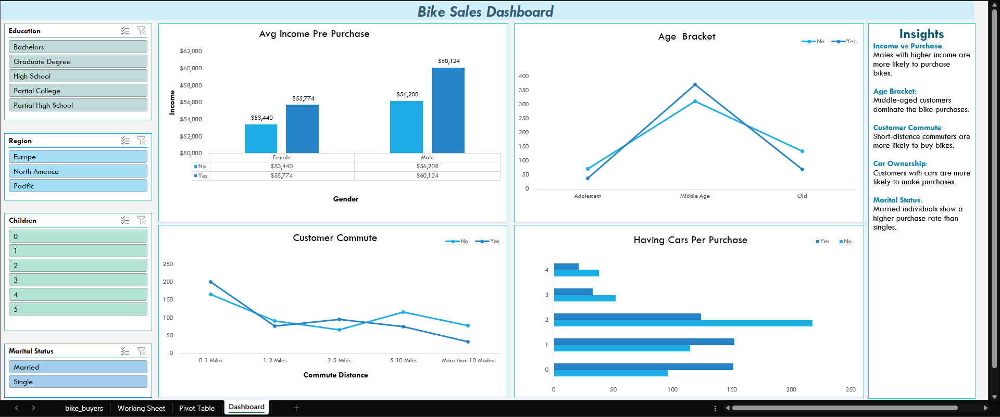

# Bike Sales Dashboard

---

This project showcases an interactive dashboard built using **Microsoft Excel** to analyze bike purchase behavior across different demographics. It provides insights into how income, age, region, marital status, and other factors influence buying decisions.

---

## Tools Used

- Microsoft Excel
- Pivot Tables
- Slicers (for filtering)
- Charts & Graphs

## Key Insights

- **Income vs Purchase**: Males with higher income are more likely to purchase bikes.
- **Age Bracket**: Middle-aged customers dominate the bike purchases.
- **Customer Commute**: Short-distance commuters are more likely to buy bikes.
- **Car Ownership**: Customers with cars are more likely to make purchases.
- **Marital Status**: Married individuals show a higher purchase rate than singles.

---

## How to Use

1. Open the Excel file: `Bike Sales Dashboard.xlsx`.
2. Navigate to the `Dashboard` sheet.
3. Use the **slicers** to filter data by:
   - Region
   - Education Level
   - Number of Children
   - Marital Status
4. Watch how the charts respond dynamically to the selected filters.

