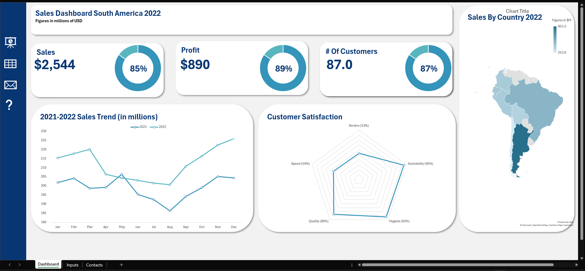

# Sales Dashboard for South America

This project is an interactive sales dashboard created using Microsoft Excel to analyze and visualize key performance data for sales in the South American region.

## Key Features

- **Key Performance Indicators (KPIs):** Displays important metrics such as Sales, Profit, and Customer count.
- **Sales by Country:** Shows a breakdown of sales performance for each country in the region.
- **Annual Performance Tracking:** Compares monthly sales for 2021 and 2022.
- **Customer Satisfaction:** Provides an overview of customer satisfaction scores for different aspects like service and quality.
- **Contacts List:** Includes a list of general sales managers for each country with their contact information.

## Tools Used

- **Excel** (for data preparation and dashboard design)
- **Pivot Tables & Charts** (for analysis and visualization)

## Insights

- **Sales and Profits:** The specified sales and profit targets were not met.
- **Performance by Country:** Argentina had the highest sales among all countries.
- **Growth Performance:** Sales in 2022 were higher than in 2021 for all months.
- **Customer Satisfaction:** The "Hygiene" and "Availability" categories recorded the highest customer satisfaction scores.

